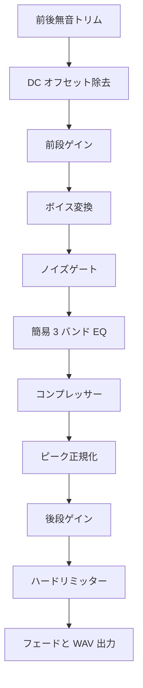

# WavVoiceShaper（Windows / C++）

16-bit PCM WAV に、整音と声質変換をプリセットで再現可能に適用する Windows 向けコマンドラインツールです。ピーク正規化、ゲイン、DC オフセット除去、前後無音トリム、フェード、簡易 3 バンド EQ、コンプレッサー、リミッター、ノイズゲート、Builtin / WORLD ボイス変換を 1 本の処理パイプラインにまとめています。

## 主な特徴

- INI による 13 種類のプリセットと、繰り返し指定できる `--set` / `--override`
- OLA・リサンプリング・FFT を用いる Builtin ボイス変換
- WORLD の分析・再合成を用いるボイス変換と、失敗時の Builtin フォールバック
- WAV の読み込み、チャンネル別処理、出力までを単一 EXE で実行
- 音声処理本体はネットワーク通信を行わない、ローカルのバッチ処理

## 処理パイプライン

処理順は固定です。各処理の有効・無効とパラメーターはプリセットまたはコマンドラインで指定します。



ピーク正規化はラウドネス（LUFS）正規化ではありません。処理後の WAV は `fmt` と `data` チャンクで再構築されるため、その他の RIFF メタデータチャンクは保持されません。

## クイックスタート

相対パスはカレントディレクトリではなく、`WavVoiceShaper.exe` の配置先を基準に解決されます。誤解を避けるため、運用時は絶対パスを推奨します。出力先ディレクトリは事前に作成してください。

```bat
WavVoiceShaper.exe ^
  --in "C:\audio\input.wav" ^
  --out "C:\audio\output.wav" ^
  --config "C:\tools\WavVoiceShaper.ini" ^
  --preset "緊急放送向け"
```

プリセットを基準に、一部の値だけを実行時に上書きできます。

```bat
WavVoiceShaper.exe ^
  --in "C:\audio\input.wav" ^
  --out "C:\audio\output.wav" ^
  --preset "明瞭化" ^
  --set PreGainDb=2.0 ^
  --set EqHighGainDb=3.0 ^
  --set CompressorRatio=3.0
```

## 収録プリセット

| 区分 | プリセット |
| --- | --- |
| 整音 | `標準`、`明瞭化`、`緊急放送向け`、`低め落ち着き`、`小型スピーカー向け`、`ラジオ風`、`カスタム` |
| 声質変換 | `男性化ボイスチェンジ`、`女性化ボイスチェンジ`、`重低音ボイスチェンジ`、`ロボットボイス`、`子供ボイス`、`ロボット自然` |

ノイズゲート機能は実装されていますが、同梱プリセットではすべて無効です。必要な場合は INI または `--set NoiseGate=1` で明示的に有効化してください。

## CLI

| オプション | 必須 | 説明 |
| --- | :---: | --- |
| `--in`, `-i` | はい | 入力 WAV |
| `--out`, `-o` | はい | 出力 WAV |
| `--config` | いいえ | INI ファイル。未指定時は EXE と同じ場所の `WavVoiceShaper.ini` |
| `--preset` | いいえ | プリセット名。通常の未指定時は `標準` |
| `--set`, `--override` | いいえ | `キー=値` を一時上書き。複数回指定可能 |
| `--help`, `-h`, `/?` | いいえ | ヘルプ表示 |

主な上書きキーは、[`WavVoiceShaper/WavVoiceShaper.ini`](WavVoiceShaper/WavVoiceShaper.ini) で確認できます。真偽値は `true/on/yes`、`false/off/no`、または整数を受け付けます。未知のキーや不正な上書き値は、現在の実装ではエラーにせず無視されます。設定ファイルがない場合やプリセット名が見つからない場合は、内蔵の既定値が使われます。

### ボイス変換エンジン

| エンジン | 実装 |
| --- | --- |
| `Builtin` | OLA タイムストレッチ、リサンプリングによるピッチ変換、FFT スペクトル包絡変換、リング変調・量子化、Dry / Wet |
| `World` | DIO、StoneMask、CheapTrick、D4C、Synthesis によるチャンネル別の分析・再合成 |
| `Auto` | WORLD を利用し、利用不可または処理失敗時に Builtin へフォールバック |

## 対応する入力

| 項目 | 条件 |
| --- | --- |
| コンテナ | RIFF / WAVE |
| 音声形式 | PCM（format code 1）、16-bit |
| チャンネル | 1 チャンネル以上 |
| 入力サイズ | 1 byte 以上、1 GiB 以下 |

非対応形式は、出力先へ無加工コピーできた場合に成功として終了します。変換済みと誤認しないよう、入力形式を事前に確認してください。

## 終了コード

| コード | 意味 |
| :---: | --- |
| `0` | 成功。非対応形式の無加工コピー成功も含む |
| `1` | 引数エラー |
| `2` | 入力ファイルなし |
| `3` | 入力読み込み失敗、または非対応形式のコピー失敗 |
| `4` | 処理失敗用の予約値 |
| `5` | 出力書き込み失敗 |

## ビルド

### 必要な環境

- Windows
- Visual Studio 2019
- Desktop development with C++
- MSVC v142 toolset
- Windows 10 SDK

Visual Studio で `WavVoiceShaper.sln` を開き、`Release | x64` を選択してビルドします。Developer Command Prompt では次のコマンドも使用できます。

```bat
msbuild WavVoiceShaper.sln /m /p:Configuration=Release /p:Platform=x64
```

ビルド後、現行の [`WavVoiceShaper.ini`](WavVoiceShaper/WavVoiceShaper.ini) を EXE と同じディレクトリへ配置してください。Release ビルドの実行には Visual C++ ランタイムが必要です。

## 品質確認

`tests/test_wav_voice_shaper.py` は、プリセット定義と第三者ライセンスの整合性に加え、合成 WAV を使って CLI の終了コード、16-bit PCM の整音、非対応形式の無加工コピーを確認します。x64 Release ビルド後、Python 3.12 以降で次のように実行できます。

```powershell
$env:WVS_EXE = (Resolve-Path ".\x64\Release\WavVoiceShaper.exe")
python -m unittest discover -s tests -p "test_*.py" -v
```

GitHub Actions の `CI` は Visual Studio 2022 の v143 toolset で x64 Release をビルドし、同じテストを実行します。プロジェクトファイルの既定 toolset は、Visual Studio 2019 向けの v142 のまま維持しています。

## リポジトリ構成

```text
.
├─ WavVoiceShaper.sln
├─ LICENSE
├─ NOTICE.md
├─ .github/workflows/ci.yml
├─ tests/test_wav_voice_shaper.py
└─ WavVoiceShaper/
   ├─ WavVoiceShaper.cpp             # CLI、WAV I/O、音声処理
   ├─ WavVoiceShaper.ini             # 13 プリセット
   ├─ WavVoiceShaper.vcxproj         # Visual C++ プロジェクト
   ├─ third_party/world/             # WORLD v1.0.1 とライセンス
   └─ tools/                          # WORLD 取得補助スクリプト
```

## BosaiVoiceDesk との連携

BosaiVoiceDesk から利用する場合は、`WavVoiceShaper.exe` と `WavVoiceShaper.ini` を `BosaiVoiceDesk.exe` と同じディレクトリへ配置し、BosaiVoiceDesk 側の `BosaiVoiceDesk.ini` で `[VoiceShaper] Enable=1` を設定します。

## 仕様上の範囲

- Windows 専用のコマンドラインアプリケーションで、ファイル単位のバッチ処理を対象とします。
- 出力先ディレクトリは自動作成されません。
- 非対応 WAV は変換せずコピーする仕様です。

## 第三者ソフトウェアとライセンス

同梱の WORLD は [mmorise/World](https://github.com/mmorise/World) v1.0.1（commit `d625e7608ca23a870018f01e7c562ac683d9847f`）に対応し、BSD 3-Clause License で提供されています。通知全文は [`WavVoiceShaper/third_party/world/LICENSE.txt`](WavVoiceShaper/third_party/world/LICENSE.txt) を参照してください。`macrodefinitions.h` に含まれる MIT ライセンス通知もソース内に保持しています。

通常のビルドには追加ダウンロードは不要です。`tools/Download_WORLD_for_WavVoiceShaper.ps1` は保守用で、実行時点の `master.zip` を取得して同梱ソースを置き換えるため、再現性が必要なビルドではそのまま実行せず、取得元のタグとハッシュを固定してください。

WavVoiceShaper のオリジナルソースコードと本プロジェクトで作成した文書は [MIT License](LICENSE) で提供します。`third_party/world/` はこの MIT License の対象外で、同ディレクトリに保持している各ライセンス通知が適用されます。配布時の表示事項は [`NOTICE.md`](NOTICE.md) にまとめています。

```text
Copyright (c) 2026 Keisuke Katahira
```
